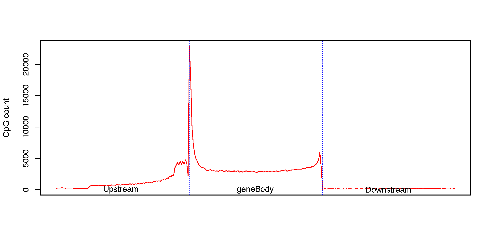

CpG_density_gene_centered
=========================

Overview
--------

``CpG_density_gene_centered`` generates a transcript-oriented CpG density
profile across three gene-centered regions:

* upstream of the transcription start site (TSS)
* gene body from TSS to transcription end site (TES)
* downstream of the TES

Each region is normalized into bins by CpGtools' density calculation
(currently 100 bins per region), producing a 5'-to-3' metagene profile.

Upstream and downstream extensions are constrained by neighboring genes, so
the actual flanking regions may be shorter than the requested maximum.

Input Files
-----------

CpG file
~~~~~~~~

The CpG input must be BED3 or BED3+ and contain genomic CpG positions.

Example::

   chr1    10847    10848
   chr1    10849    10850
   chr1    15864    15865

Compressed input is supported by the CpGtools reader.

Reference gene model
~~~~~~~~~~~~~~~~~~~~

The reference gene model must be BED6+ and include strand information so that
TSS, TES, upstream, and downstream directions can be determined.

Usage
-----

Basic usage::

   CpG_density_gene_centered \
       -i 850K_probe.hg19.bed3.gz \
       -r hg19.RefSeq.union.bed.gz \
       -o CpG_density

Useful options include:

* ``-u``, ``--upstream`` -- maximum upstream extension from the TSS in bp
  (default: 2000)
* ``-d``, ``--downstream`` -- maximum downstream extension from the TES in bp
  (default: 2000)
* ``-c``, ``--min_gene_size``, ``--SizeCut`` -- minimum transcript span from
  TSS to TES (default: 200 bp)
* ``--format {png,pdf,both}`` -- plot output format (default: ``pdf``)
* ``--dpi`` -- PNG resolution (default: 300)
* ``--width`` -- plot width in inches (default: 10)
* ``--height`` -- plot height in inches (default: 5)
* ``--no_plot`` -- write the density table without generating a plot
* ``-o``, ``--out_prefix``, ``--output`` -- output prefix

Display all options with::

   CpG_density_gene_centered -h

Output
------

For output prefix ``CpG_density``, the command always writes:

* ``CpG_density.CpG_density.tsv`` -- normalized CpG density profile

The table contains:

* ``Group`` -- ``Upstream``, ``GeneBody``, or ``Downstream``
* ``Position`` -- normalized bin position within the region
* ``CpG_count`` -- CpG count for that bin

Unless ``--no_plot`` is used, the command also writes one or more plots:

* ``CpG_density.CpG_density.pdf``
* ``CpG_density.CpG_density.png``

Use ``--format both`` to generate both plot formats.

Example Data
------------

* `850K probe BED3 file <https://sourceforge.net/projects/cpgtools/files/test/850K_probe.hg19.bed3.gz>`_
* `hg19 RefSeq gene model <https://sourceforge.net/projects/cpgtools/files/refgene/hg19.RefSeq.union.bed.gz>`_

Example Figure
--------------

