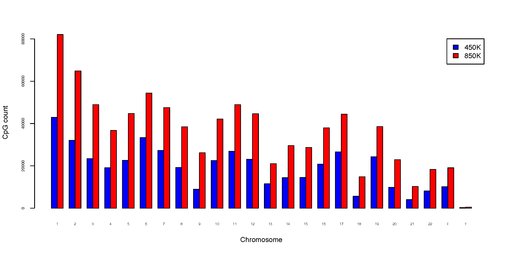
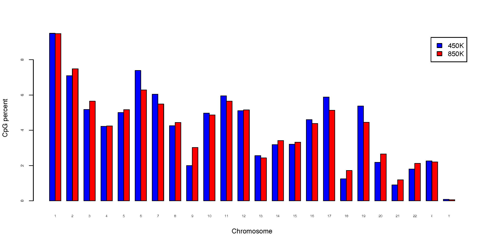
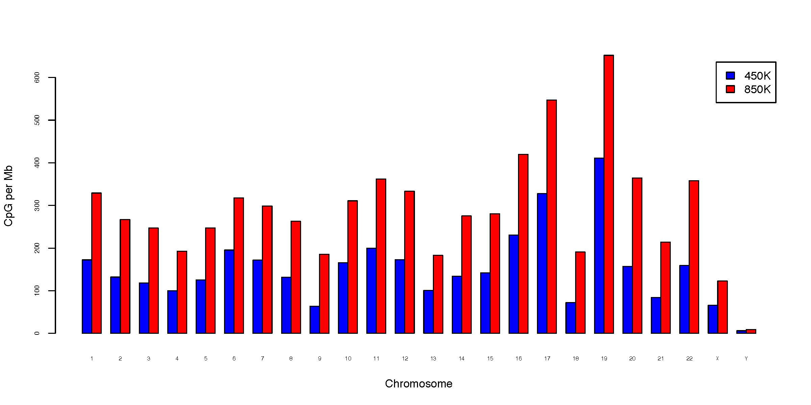

CpG_distrb_chrom
================

Overview
--------

``CpG_distrb_chrom`` summarizes and visualizes the distribution of CpGs
across chromosomes.

For each input sample, the command reports:

* total CpG count per chromosome;
* percentage of all counted CpGs assigned to each chromosome; and
* CpG density per megabase (Mb).

One or more BED3+ CpG files can be analyzed together. Chromosome inclusion
and plotting order are determined by the chromosome-size file.

Input Files
-----------

CpG BED files
~~~~~~~~~~~~~

Each input file must contain at least three BED columns:

``chrom``, ``start``, ``end``

Compressed input is supported.

Multiple files may be supplied either as separate arguments::

   -i sample1.bed.gz sample2.bed.gz sample3.bed.gz

or as a single comma-separated argument for backward compatibility::

   -i sample1.bed.gz,sample2.bed.gz,sample3.bed.gz

Invalid BED records are ignored with a warning.

Chromosome-size file
~~~~~~~~~~~~~~~~~~~~

The chromosome-size file must contain at least two columns:

``chromosome`` and ``size``

Example::

   chr1    249250621
   chr2    243199373
   chr3    198022430

Chromosome order in this file determines the order used in output tables and
plots.

Chromosome names must be unique and chromosome sizes must be positive.

Sample Names
------------

Use ``-n`` / ``--names`` to provide sample labels. Names may be supplied as
separate arguments::

   -n 450K 850K

or as a comma-separated argument::

   -n 450K,850K

The number of names must match the number of input files, and sample names
must be unique.

If ``--names`` is omitted, input filenames are used as sample names.

Usage
-----

Basic usage::

   CpG_distrb_chrom \
       -i 450K_probe.hg19.bed3.gz 850K_probe.hg19.bed3.gz \
       -n 450K 850K \
       -s hg19.chrom.sizes \
       -o chromDist

Useful options include:

* ``-s``, ``--chrom_size``, ``--chrom-size`` -- chromosome-size file
* ``--format {png,pdf,both}`` -- plot output format (default: ``pdf``)
* ``--dpi`` -- PNG resolution (default: 300)
* ``--width`` -- plot width in inches (default: 12)
* ``--height`` -- plot height in inches (default: 6)
* ``--no_plot`` -- write summary tables without generating plots
* ``--max_plot_samples`` -- maximum number of samples allowed in grouped bar
  plots (default: 12); use 0 to disable this limit
* ``--strict_chromosomes`` -- stop if an input BED file contains chromosomes
  absent from the chromosome-size file
* ``-o``, ``--out_prefix``, ``--output`` -- output prefix

Display all options with::

   CpG_distrb_chrom -h

Chromosomes Not in the Size File
--------------------------------

By default, CpGs on chromosomes absent from the chromosome-size file are
ignored with a warning.

Use ``--strict_chromosomes`` to treat such chromosomes as an error.

Percentages are calculated using only CpGs assigned to chromosomes present in
the chromosome-size file.

Output
------

For output prefix ``chromDist``, four summary tables are written:

* ``chromDist.chrom_distribution.tsv`` -- combined count, percentage, and
  density results
* ``chromDist.chrom_counts.tsv`` -- CpG counts
* ``chromDist.chrom_percent.tsv`` -- percentage of CpGs
* ``chromDist.chrom_perMb.tsv`` -- CpG density per Mb

The combined table contains ``Chromosome`` and ``ChromSize`` followed by three
columns per sample:

* ``<sample>.CpG_count``
* ``<sample>.CpG_percent``
* ``<sample>.CpG_perMb``

CpG density is calculated as:

.. math::

   \mathrm{CpG\ per\ Mb}
   =
   \frac{\mathrm{CpG\ count} \times 10^6}
        {\mathrm{chromosome\ size}}

Plots
-----

Unless ``--no_plot`` is used, three grouped bar plots are generated:

* ``chromDist.CpG_total.pdf`` -- CpG count by chromosome
* ``chromDist.CpG_percent.pdf`` -- percentage of CpGs by chromosome
* ``chromDist.CpG_perMb.pdf`` -- CpG density per Mb

With ``--format png``, the corresponding ``.png`` files are written.
Use ``--format both`` to generate both PDF and PNG files.

By default, plots are skipped when more than 12 samples are supplied. This
limit can be changed with ``--max_plot_samples``.

Example Data
------------

* `450K probe BED3 file <https://sourceforge.net/projects/cpgtools/files/test/450K_probe.hg19.bed3.gz>`_
* `850K probe BED3 file <https://sourceforge.net/projects/cpgtools/files/test/850K_probe.hg19.bed3.gz>`_
* `hg19 chromosome sizes <https://sourceforge.net/projects/cpgtools/files/refgene/hg19.chrom.sizes>`_

Example Figures
---------------

Total CpG count per chromosome:

Percentage of CpGs on each chromosome:

CpG density per megabase:

