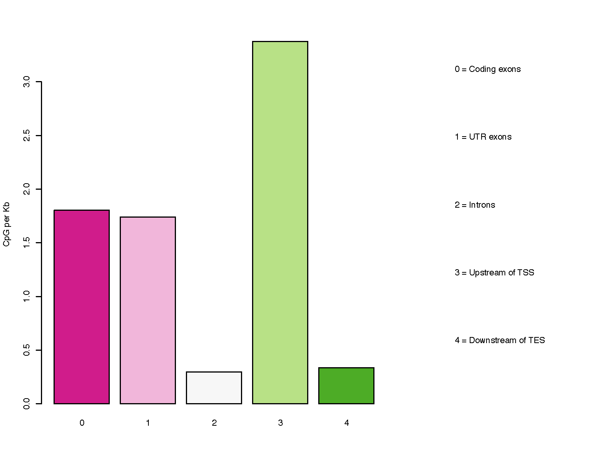

CpG_distrb_gene_centered
========================

Overview
--------

``CpG_distrb_gene_centered`` summarizes CpG distribution across prioritized
gene-centered genomic annotations.

The genome is partitioned into five annotation classes:

* coding exons
* UTR exons
* introns
* upstream regions of transcription start sites (TSS)
* downstream regions of transcription end sites (TES)

Because transcript annotations can overlap, the classes are made
non-overlapping using the following priority:

#. Coding exons
#. UTR exons
#. Introns
#. Upstream of TSS
#. Downstream of TES

Higher-priority annotations override lower-priority annotations. For example,
a region annotated as both exon and intron is counted as exon.

Input Files
-----------

CpG file
~~~~~~~~

The CpG input must be BED3 or BED3+ and contain genomic CpG positions.

Example::

   chr1    10847    10848
   chr1    10849    10850
   chr1    15864    15865

Compressed input is supported by the CpGtools reader.

Reference gene model
~~~~~~~~~~~~~~~~~~~~

The reference gene model must be in BED12 format.

Usage
-----

Basic usage::

   CpG_distrb_gene_centered \
       -i 850K_probe.hg19.bed3.gz \
       -r hg19.RefSeq.union.bed.gz \
       -o geneDist

Useful options include:

* ``-u``, ``--upstream`` -- upstream region size relative to the TSS
  (default: 2000 bp)
* ``-d``, ``--downstream`` -- downstream region size relative to the TES
  (default: 2000 bp)
* ``--format {png,pdf,both}`` -- plot output format
  (default: ``pdf``)
* ``--dpi`` -- PNG resolution (default: 300)
* ``--width`` -- plot width in inches (default: 8)
* ``--height`` -- plot height in inches (default: 6)
* ``--no_plot`` -- write the summary table without generating a plot
* ``-o``, ``--out_prefix``, ``--output`` -- output prefix

Display all options with::

   CpG_distrb_gene_centered -h

Output
------

For output prefix ``geneDist``, the command always writes:

* ``geneDist.gene_centered_distribution.tsv`` -- gene-centered CpG summary

The table contains:

.. list-table::
   :header-rows: 1
   :widths: 28 72

   * - Column
     - Description
   * - ``Priority_order``
     - Numeric priority of the annotation class.
   * - ``Name``
     - Annotation class.
   * - ``Number_of_regions``
     - Number of non-overlapping intervals in the class.
   * - ``Size_of_regions_bp``
     - Total number of annotated bases.
   * - ``CpG_raw_count``
     - Number of CpGs overlapping the class.
   * - ``CpG_count_per_KB``
     - CpG density per kilobase.

CpG density is calculated as:

.. math::

   \mathrm{CpG\ count\ per\ KB}
   =
   \frac{\mathrm{CpG\ raw\ count} \times 1000}
        {\mathrm{Size\ of\ regions\ in\ bp}}

Unless ``--no_plot`` is used, the command also writes one or more plots:

* ``geneDist.gene_centered_distribution.pdf``
* ``geneDist.gene_centered_distribution.png``

Use ``--format both`` to generate both plot formats.

Example Data
------------

* `850K probe BED3 file <https://sourceforge.net/projects/cpgtools/files/test/850K_probe.hg19.bed3.gz>`_
* `hg19 RefSeq BED12 gene model <https://sourceforge.net/projects/cpgtools/files/refgene/hg19.RefSeq.union.bed.gz>`_

Example Figure
--------------

