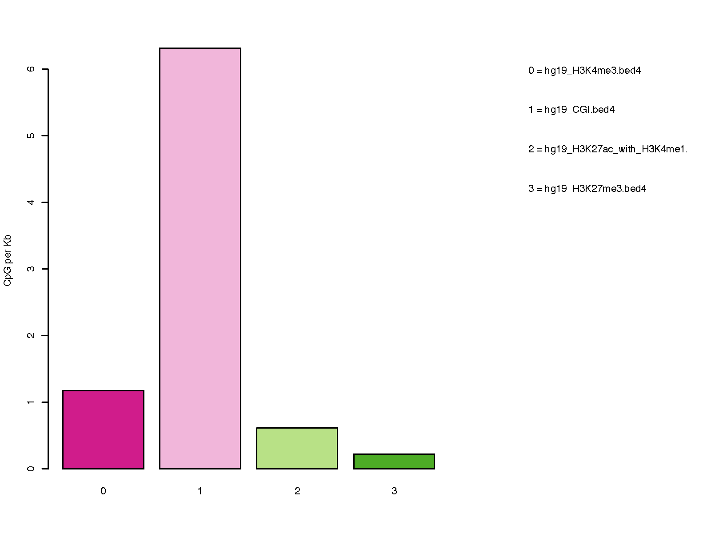

CpG_distrb_region
=================

Overview
--------

``CpG_distrb_region`` summarizes CpG distribution across prioritized
user-defined genomic region classes.

One CpG BED3+ file is compared against one or more BED3+ annotation files.
The order of annotation files defines their priority. Regions from
lower-priority classes are merged and then have all higher-priority regions
subtracted, making the final classes mutually exclusive.

For each region class, the command reports:

* priority order;
* region-class name;
* number of non-overlapping regions;
* total annotated size in base pairs;
* raw CpG count; and
* CpG density per kilobase.

Input Files
-----------

CpG file
~~~~~~~~

The CpG input must be BED3 or BED3+ and contain genomic CpG positions.

Example::

   chr1    10847    10848
   chr1    10849    10850
   chr1    15864    15865

Compressed input is supported.

Region files
~~~~~~~~~~~~

One or more BED3+ files define the genomic region classes.

Files may be supplied as separate arguments::

   -b promoters.bed enhancers.bed intergenic.bed

or as a comma-separated list for backward compatibility::

   -b promoters.bed,enhancers.bed,intergenic.bed

The first BED file has the highest priority, the second has the next highest
priority, and so on.

For example, if ``promoters.bed`` is listed before ``enhancers.bed``, any
enhancer bases overlapping promoters are removed from the enhancer class.

Region Names
------------

Use ``-n`` / ``--names`` to assign labels to the region classes.

Names may be supplied as separate arguments::

   -n Promoter CpG_island Enhancer

or as a comma-separated list::

   -n Promoter,CpG_island,Enhancer

The number of names must match the number of BED files, and names must be
unique.

If names are omitted, the BED filenames are used as region-class names.

Usage
-----

Basic usage::

   CpG_distrb_region \
       -i 850K_probe.hg19.bed3.gz \
       -b hg19_H3K4me3.bed4 hg19_CGI.bed4 \
          hg19_H3K27ac_with_H3K4me1.bed4 hg19_H3K27me3.bed4 \
       -n Promoter CpG_island Bivalent_promoter Heterochromatin \
       -o regionDist

Useful options include:

* ``-i``, ``--cpg`` -- CpG BED3+ input file
* ``-b``, ``--bed`` -- one or more BED3+ region files, ordered from highest
  to lowest priority
* ``-n``, ``--names`` -- optional region-class names
* ``--format {png,pdf,both}`` -- plot output format
  (default: ``pdf``)
* ``--dpi`` -- PNG resolution (default: 300)
* ``--width`` -- plot width in inches (default: 8)
* ``--height`` -- plot height in inches (default: 6)
* ``--no_plot`` -- write the summary table without generating a plot
* ``-o``, ``--out_prefix``, ``--output`` -- output prefix

Display all options with::

   CpG_distrb_region -h

Output
------

For output prefix ``regionDist``, the command always writes:

* ``regionDist.region_distribution.tsv`` -- region-level CpG summary

The table contains:

.. list-table::
   :header-rows: 1
   :widths: 28 72

   * - Column
     - Description
   * - ``Priority_order``
     - Zero-based priority of the region class; 0 is highest priority.
   * - ``Name``
     - Region-class name.
   * - ``Number_of_regions``
     - Number of non-overlapping intervals remaining after prioritization.
   * - ``Size_of_regions_bp``
     - Total size of the prioritized region class in base pairs.
   * - ``CpG_raw_count``
     - Number of CpGs overlapping the region class.
   * - ``CpG_count_per_KB``
     - CpG density per kilobase.

CpG density is calculated as:

.. math::

   \mathrm{CpG\ count\ per\ KB}
   =
   \frac{\mathrm{CpG\ raw\ count} \times 1000}
        {\mathrm{Size\ of\ regions\ in\ bp}}

Unless ``--no_plot`` is used, the command also writes one or more plots:

* ``regionDist.region_distribution.pdf``
* ``regionDist.region_distribution.png``

Use ``--format both`` to generate both plot formats.

Example Data
------------

* `850K probe BED3 file <https://sourceforge.net/projects/cpgtools/files/test/850K_probe.hg19.bed3.gz>`_
* `CpG islands <https://sourceforge.net/projects/cpgtools/files/test/hg19_CGI.bed4>`_
* `H3K4me3 regions <https://sourceforge.net/projects/cpgtools/files/test/hg19_H3K4me3.bed>`_
* `H3K27ac with H3K4me1 regions <https://sourceforge.net/projects/cpgtools/files/test/hg19_H3K27ac_with_H3K4me1.bed4>`_
* `H3K27me3 regions <https://sourceforge.net/projects/cpgtools/files/test/hg19_H3K27me3.bed4>`_

Example Figure
--------------

