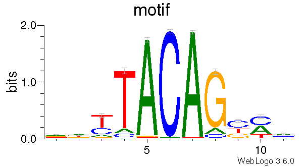

CpG_logo
========

Overview
--------

``CpG_logo`` extracts strand-aware genomic sequence around CpG sites, builds
motif matrices, and optionally generates sequence logos.

For each valid CpG record, the command:

* extracts a sequence window from the reference genome;
* writes the sequences to FASTA;
* writes PFM, PPM, PWM, JASPAR, and MEME motif files; and
* generates PDF and PNG sequence logos when WebLogo and Ghostscript are
  available.

Input Files
-----------

CpG BED file
~~~~~~~~~~~~

The input BED file must contain at least six columns:

``chrom``, ``chromStart``, ``chromEnd``, ``name``, ``score``, ``strand``

Example::

   chr1    10000    10001    cg00000001    0    +
   chr1    20000    20001    cg00000002    0    -

The third BED column, ``chromEnd``, is treated as the genomic position of the
methylated cytosine, preserving the historical CpGtools behavior.

The strand must be ``+`` or ``-``. For minus-strand records, the extracted
sequence is reverse-complemented.

Compressed ``.gz`` and ``.bz2`` input files are supported.

Reference genome
~~~~~~~~~~~~~~~~

The reference genome must be supplied in FASTA format.

If the corresponding ``.fai`` index is missing, ``CpG_logo`` creates it
automatically using ``pysam.faidx()``.

Sequence Window
---------------

With ``--extend N``, the extracted sequence extends ``N`` bases upstream and
``N`` bases downstream of the CpG position.

The sequence length is therefore:

.. math::

   2N + 1

The default is ``N = 5``, producing an 11-bp sequence.

Records are skipped when:

* the BED line has fewer than six columns;
* the coordinate or strand is invalid;
* the chromosome is absent from the reference genome;
* the requested interval falls outside chromosome boundaries; or
* the extracted sequence contains ambiguous bases such as ``N``.

Requirements
------------

``CpG_logo`` requires the Python package ``pysam`` for FASTA access.

Sequence logos additionally require:

* `WebLogo <https://github.com/WebLogo/weblogo>`_
* Ghostscript (the ``gs`` executable)

If WebLogo or Ghostscript is unavailable, logo generation is skipped with a
warning, but the FASTA and motif-matrix files are still generated.

Usage
-----

Basic usage::

   CpG_logo \
       -i 450_CH.hg19.bed.gz \
       -r hg19.fa \
       -o 450_CH

Useful options include:

* ``-e``, ``--extend`` -- bases to extend upstream and downstream
  (default: 5)
* ``-n``, ``--name`` -- motif name used in motif outputs and the sequence logo
  (default: ``motif``)
* ``-o``, ``--output`` -- output prefix
* ``-r``, ``--refgenome`` -- reference FASTA file

Display all options with::

   CpG_logo -h

Output
------

For output prefix ``450_CH``, the command writes:

* ``450_CH.fa`` -- extracted sequences
* ``450_CH.pfm`` -- position frequency matrix
* ``450_CH.ppm`` -- position probability matrix
* ``450_CH.pwm`` -- position weight matrix
* ``450_CH.jaspar`` -- JASPAR-format motif
* ``450_CH.meme`` -- MEME-format motif

When WebLogo and Ghostscript are available, it also writes:

* ``450_CH.logo.pdf``
* ``450_CH.logo.png``

Example Data
------------

* `450_CH.hg19.bed.gz
  <https://sourceforge.net/projects/cpgtools/files/test/450_CH.hg19.bed.gz>`_
* `hg19 reference genome
  <http://hgdownload.soe.ucsc.edu/goldenPath/hg19/bigZips/hg19.fa.gz>`_
* `hg38 reference genome
  <http://hgdownload.soe.ucsc.edu/goldenPath/hg38/bigZips/hg38.fa.gz>`_

Example Figure
--------------

