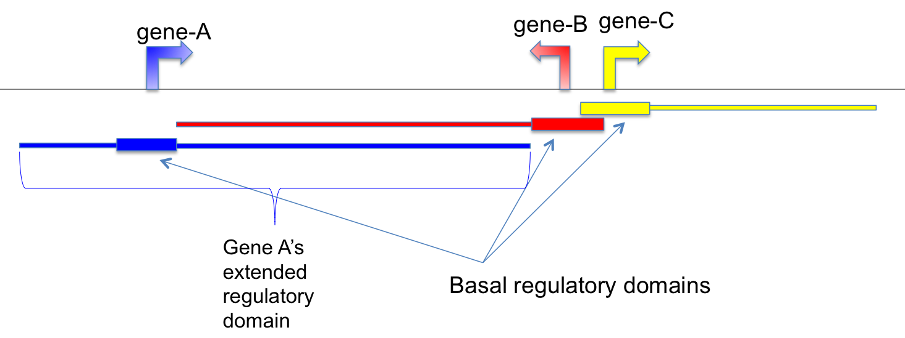

CpG_to_gene
===========

Overview
--------

``CpG_to_gene`` assigns CpGs or other genomic intervals to putative target
genes using the **basal plus extension** regulatory-domain rules used by
`GREAT <http://great.stanford.edu/public/html/>`_.

Two regulatory domains are considered for each gene:

* **Basal regulatory domain** -- a fixed region around the transcription start
  site (TSS). By default, it extends 5 kb upstream and 1 kb downstream.
* **Extended regulatory domain** -- the basal domain is extended in both
  directions until the nearest neighboring basal domain is reached, or until
  the maximum extension distance is reached. The default maximum extension is
  1,000 kb.

Basal domains of nearby genes may overlap.

Input Files
-----------

CpG file
~~~~~~~~

The input must be BED3 or BED3+.

Example::

   chr1    10524    10525
   chr1    10847    10848
   chr1    15864    15865

Plain-text and compressed ``.gz`` or ``.bz2`` input files are supported.

Comment lines beginning with ``#`` are copied to the output. UCSC ``track``
and ``browser`` lines are skipped. Invalid BED records are skipped with a
warning.

Reference gene model
~~~~~~~~~~~~~~~~~~~~

The reference gene model must be in BED12 format.

Because CpG-to-gene assignment depends strongly on the gene annotation,
a conservative gene model is recommended. For genes with multiple isoforms,
consider using a collapsed or canonical transcript representation.

Usage
-----

Basic usage::

   CpG_to_gene \
       -i 850K_probe.hg19.bed3.gz \
       -r hg19.RefSeq.union.bed.gz \
       -o output

Useful options include:

* ``-u``, ``--basal-up`` -- upstream distance from the TSS used for the basal
  domain (default: 5000 bp)
* ``-d``, ``--basal-down`` -- downstream distance from the TSS used for the
  basal domain (default: 1000 bp)
* ``-e``, ``--extension`` -- maximum extension distance used for the extended
  regulatory domain (default: 1,000,000 bp)
* ``-o``, ``--output`` -- output prefix

All three distance parameters must be zero or greater.

Display all options with::

   CpG_to_gene -h

Output
------

For output prefix ``output``, the command writes:

* ``output.associated_genes.txt``

Two columns are appended to each valid input record:

#. genes whose **basal regulatory domains** overlap the CpG;
#. genes found in the **extended regulatory domains but not already reported
   in the basal-domain column**.

Multiple genes are separated by semicolons. ``//`` indicates that no gene was
found for that column.

Example::

   #The last column contains genes whose extended regulatory domain are overlapped with the CpG
   #The 2nd last column contains genes whose basal regulatory domain are overlapped with the CpG
   #"//" indicates no genes are found
   chr1    10524    10525    DDX11L1             //
   chr1    10847    10848    DDX11L1             //
   chr1    15864    15865    //                   DDX11L1;MIR6859-1
   chr1    18826    18827    MIR6859-1            //

Assignment Behavior
-------------------

A CpG may overlap the regulatory domains of multiple genes.

The second appended column contains **extended-only** assignments: genes
already present in the basal-domain column are removed from the extended
column. This avoids reporting the same gene twice for the same CpG.

Example Data
------------

* `850K probe BED3 file
  <https://sourceforge.net/projects/cpgtools/files/test/850K_probe.hg19.bed3.gz>`_
* `hg19 RefSeq BED12 gene model
  <https://sourceforge.net/projects/cpgtools/files/refgene/hg19.RefSeq.union.bed.gz>`_
