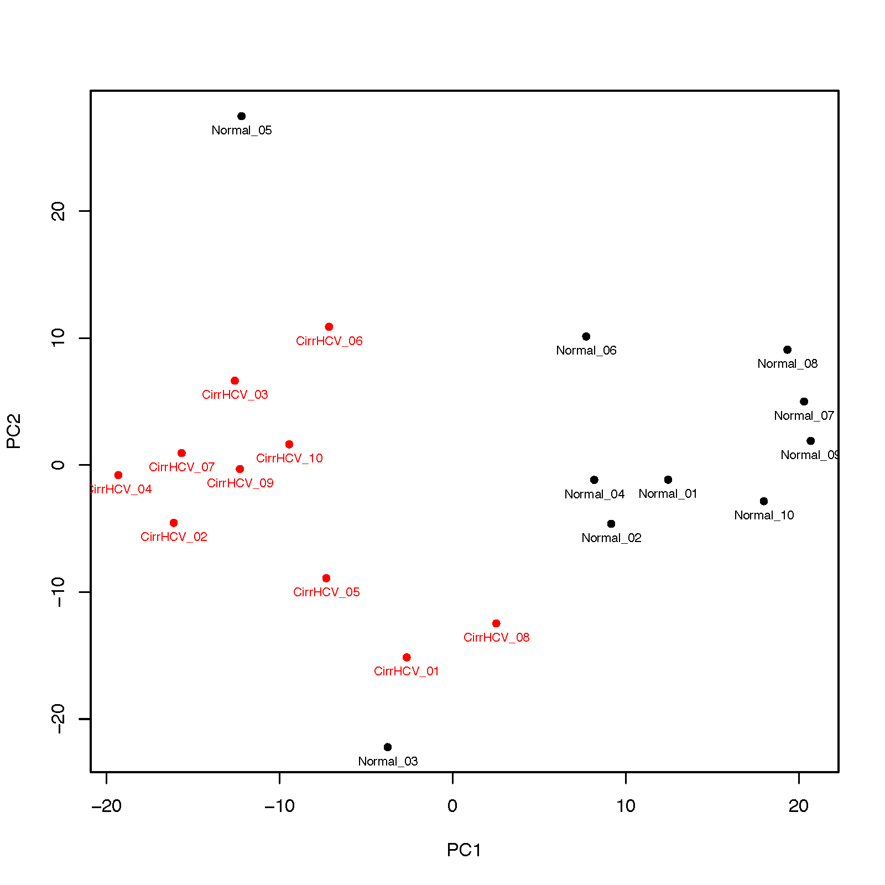

beta_PCA
========

Overview
--------

``beta_PCA`` performs principal component analysis (PCA) on DNA methylation
Beta-value matrices to visualize relationships among samples.

The input matrix must have **CpGs in rows** and **samples in columns**.
CpGs containing missing values across the samples used for PCA are removed.
By default, CpG values are standardized before PCA.

Input Files
-----------

Beta matrix
~~~~~~~~~~~

The first column contains CpG IDs and the remaining columns contain sample
Beta-values. Common delimiters and compressed input are supported.

Example::

   CpG_ID   Sample_01   Sample_02   Sample_03   Sample_04
   cg_001   0.831035    0.878022    0.794427    0.880911
   cg_002   0.249544    0.209949    0.234294    0.236680
   cg_003   0.845065    0.843957    0.840184    0.824286

At least two sample columns are required. Duplicate CpG IDs are reduced to the
first occurrence, whereas sample IDs must be unique.

Group file
~~~~~~~~~~

A two-column sample/group file is required. Comma- and tab-delimited files are
supported, with or without a header.

Example::

   Sample,Group
   Sample_01,normal
   Sample_02,normal
   Sample_03,tumor
   Sample_04,tumor

Samples present in the Beta matrix but absent from the group file are excluded
with a warning. At least two samples must be shared between the two files.

Usage
-----

Basic usage::

   beta_PCA \
       -i cirrHCV_vs_normal.data.tsv \
       -g cirrHCV_vs_normal.grp.csv \
       -o HCV_vs_normal

Useful options include:

* ``-n``, ``--n_components``, ``--ncomponent`` -- number of principal
  components to calculate (default: 2)
* ``-l``, ``--label`` -- add sample IDs to the plot
* ``-c``, ``--marker`` -- plot marker: ``o``, ``.``, ``^``, ``s``, ``D``, or
  ``x`` (default: ``o``)
* ``-a``, ``--alpha`` -- point opacity between 0 and 1 (default: 0.7)
* ``--legend_location`` -- legend position (default: ``best``)
* ``--loading`` -- write the PCA loading matrix
* ``--no_standardize`` -- skip CpG standardization before PCA
* ``--width`` / ``--height`` -- plot size in inches (default: 8 x 8)
* ``--dpi`` -- plot resolution (default: 300)
* ``-o``, ``--out_prefix``, ``--output`` -- output prefix

Display all options with::

   beta_PCA -h

Output
------

For output prefix ``HCV_vs_normal``, the command writes:

* ``HCV_vs_normal.PCA.tsv`` -- PCA scores for each sample
* ``HCV_vs_normal.PCA_variance.tsv`` -- explained and cumulative variance for
  each component
* ``HCV_vs_normal.PCA.png`` -- PCA scatter plot

When ``--loading`` is used, it also writes:

* ``HCV_vs_normal.PCA_loadings.tsv`` -- CpG loading matrix

The variance explained by each component is also reported to the log.

Example Data
------------

* `Beta matrix <https://sourceforge.net/projects/cpgtools/files/test/cirrHCV_vs_normal.data.tsv>`_
* `Group file <https://sourceforge.net/projects/cpgtools/files/test/cirrHCV_vs_normal.grp.csv>`_

Example Figure
--------------

