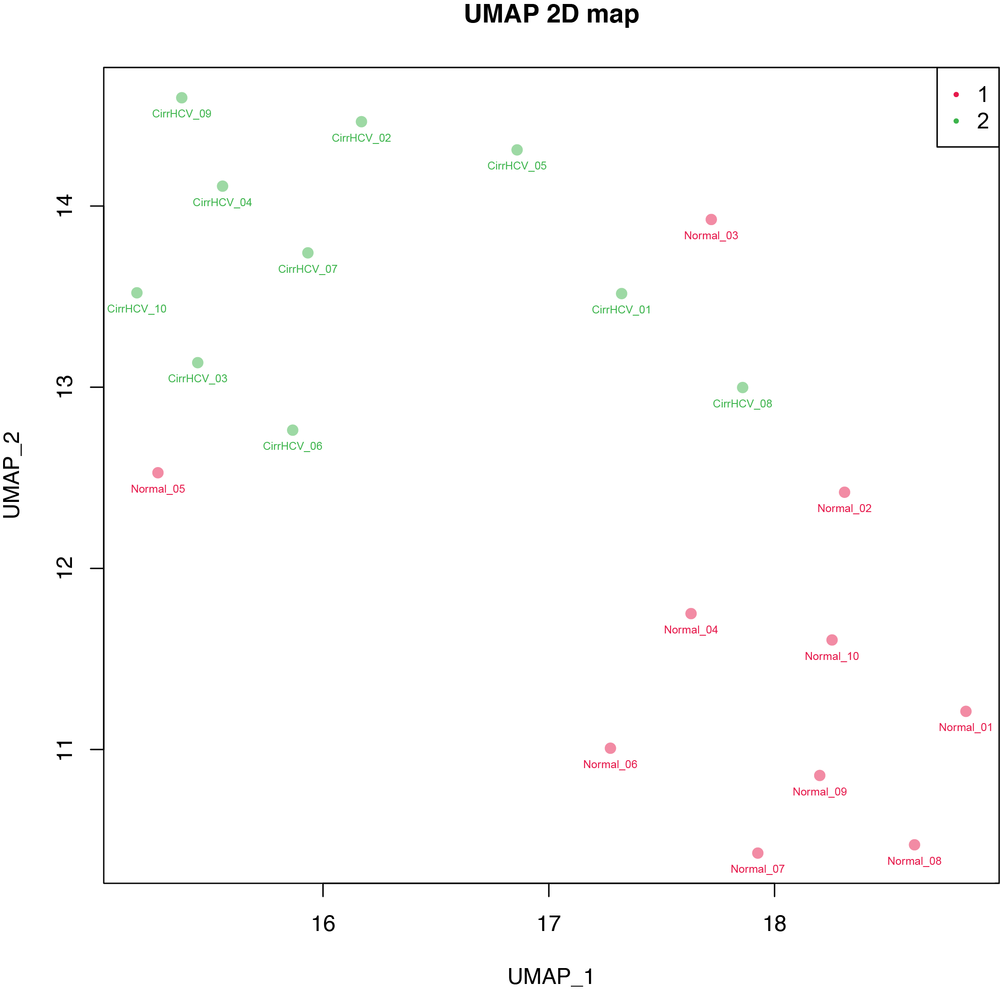

beta_UMAP
=========

Overview
--------

``beta_UMAP`` performs Uniform Manifold Approximation and Projection (UMAP)
on DNA methylation samples.

The input matrix must have **CpGs in rows** and **samples in columns**. CpGs
are treated as features and samples as observations.

A sample-group file is optional and can be used to color samples in the plot.

Input Files
-----------

Beta matrix
~~~~~~~~~~~

The first column contains CpG IDs and the remaining columns contain sample
Beta-values. Common delimiters and compressed input are supported.

Example::

   CpG_ID   Sample_01   Sample_02   Sample_03   Sample_04
   cg_001   0.831035    0.878022    0.794427    0.880911
   cg_002   0.249544    0.209949    0.234294    0.236680
   cg_003   0.845065    0.843957    0.840184    0.824286

Requirements:

* at least three samples;
* unique CpG IDs;
* unique sample IDs.

Finite values outside the expected Beta-value range [0, 1] are retained, but
a warning is reported.

Group file
~~~~~~~~~~

The optional group file contains two columns: sample ID and group label.
Comma- and tab-delimited files are supported, with or without a header.

Example::

   Sample,Group
   Sample_01,normal
   Sample_02,normal
   Sample_03,tumor
   Sample_04,tumor

If a group file is supplied, every sample in the Beta matrix must be present
in the group file.

If no group file is supplied, all samples are assigned to one group named
``All_samples``.

Missing Values and Preprocessing
--------------------------------

By default:

* CpGs containing any missing value are removed;
* zero-variance CpGs are removed; and
* CpG features are standardized across samples before UMAP.

Use ``--na_policy impute`` to replace missing values with the per-CpG mean.
CpGs containing only missing values are removed before imputation.

Use ``--no_standardize`` to skip feature standardization.

Usage
-----

Basic usage::

   beta_UMAP \
       -i cirrHCV_vs_normal.data.tsv \
       -g cirrHCV_vs_normal.grp.csv \
       -o cirrHCV_vs_normal

Useful options include:

* ``-n``, ``--n_components``, ``--ncomponent`` -- embedding dimensions,
  either 2 or 3 (default: 2)
* ``--n_neighbors``, ``--nneighbors`` -- number of neighboring samples used
  to learn local manifold structure (default: 15); must be at least 2 and
  smaller than the number of samples
* ``--min_dist``, ``--min-dist`` -- minimum distance between embedded points
  (default: 0.2)
* ``--spread`` -- effective embedding scale (default: 1.0)
* ``--metric`` -- distance metric accepted by ``umap-learn``
  (default: ``euclidean``)
* ``--init {spectral,random}`` -- initialization method
  (default: ``spectral``)
* ``--densmap`` -- enable densMAP
* ``--seed`` -- random seed (default: 99)
* ``--na_policy {drop,impute}`` -- missing-value handling
  (default: ``drop``)
* ``--no_standardize`` -- skip CpG standardization
* ``--label`` -- add sample IDs to the plot
* ``--marker {circle,dot}`` -- plot marker style (default: ``circle``)
* ``--alpha`` -- point opacity (default: 0.8)
* ``--point_size`` -- point size (default: 45)
* ``--legend_location`` -- legend position (default: ``best``)
* ``--format {png,pdf,both}`` -- plot format (default: ``pdf``)
* ``--dpi`` -- PNG resolution (default: 300)
* ``--width`` / ``--height`` -- plot size in inches (default: 8 x 8)
* ``--no_plot`` -- write coordinates without generating a plot
* ``-o``, ``--out_prefix``, ``--output`` -- output prefix

``--min_dist`` must be in [0, 1), ``--spread`` must be greater than zero, and
``--min_dist`` cannot be greater than ``--spread``.

Display all options with::

   beta_UMAP -h

Output
------

For output prefix ``cirrHCV_vs_normal``, the command always writes:

* ``cirrHCV_vs_normal.UMAP.tsv`` -- UMAP coordinates and group labels

Unless ``--no_plot`` is used, it also writes one or more plots:

* ``cirrHCV_vs_normal.UMAP.pdf``
* ``cirrHCV_vs_normal.UMAP.png``

Use ``--format both`` to generate both plot formats.

The coordinate table contains ``UMAP1`` and ``UMAP2`` for a 2D embedding,
and also ``UMAP3`` when ``--n_components 3`` is used. Plotting always uses the
first two dimensions.

Example Data
------------

* `Beta matrix <https://sourceforge.net/projects/cpgtools/files/test/cirrHCV_vs_normal.data.tsv>`_
* `Group file <https://sourceforge.net/projects/cpgtools/files/test/cirrHCV_vs_normal.grp.csv>`_

Example Figure
--------------

