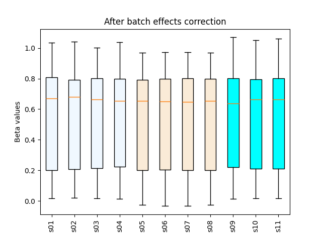

beta_combat.py
============================

Correct beta-value matrices for technical (batch) effects using the
`ComBat <https://pubmed.ncbi.nlm.nih.gov/16632515/>`_ algorithm.

Overview
--------

``beta_combat.py`` takes a CpG × sample beta matrix and a
sample-to-batch mapping, applies ComBat, and writes an adjusted matrix
plus before/after QC boxplots.

Synopsis
--------

::

   beta_combat.py \
     -i <beta_matrix.tsv[.gz]> \
     -g <batch_map.csv> \
     -o <output_prefix>

Input files
-----------

Beta matrix (TSV/TSV.GZ)
~~~~~~~~~~~~~~~~~~~~~~~~

- **Delimiter:** tab  
- **Header:** first row contains sample IDs  
- **Index:** first column contains CpG IDs  
- **Values:** beta values in [0, 1]  
- **Missing values:** rows containing any NA/empty cells are removed prior to ComBat  

Example::

   CpG_ID   Sample_01  Sample_02  Sample_03  Sample_04
   cg_001   0.831035   0.878022   0.794427   0.880911
   cg_002   0.249544   0.209949   0.234294   0.236680
   cg_003   0.845065   0.843957   0.840184   0.824286
   ...

Batch map (CSV)
~~~~~~~~~~~~~~~

- **Delimiter:** comma  
- **Columns:** ``Sample,Group``  
- **Sample IDs:** must match the sample IDs in the beta matrix header (case-sensitive)  
- **Grouping:** each sample belongs to exactly one batch group (e.g., plates, chips)  

Example::

   Sample,Group
   Sample_01,plate_1
   Sample_02,plate_1
   Sample_03,plate_2
   Sample_04,plate_2
   ...

Example input files
~~~~~~~~~~~~~~~~~~~

- `test_12_threebatch.beta.tsv.gz <https://sourceforge.net/projects/cpgtools/files/test/test_12_threebatch.beta.tsv.gz>`_
- `test_12_threebatch.batch.csv <https://sourceforge.net/projects/cpgtools/files/test/test_12_threebatch.batch.csv>`_

Command example
---------------

::

   $ beta_combat.py \
       -i test_12_threebatch.beta.tsv.gz \
       -g test_12_threebatch.batch.csv \
       -o output

Example log (abridged)
~~~~~~~~~~~~~~~~~~~~~~

::

   @ 2025-10-07 10:14:37: Reading input file: "test_12_threebatch.beta.tsv.gz" ...
   @ 2025-10-07 10:14:38: 0 rows with missing values were removed.
   @ 2025-10-07 10:14:38: Reading group file: "test_12_threebatch.batch.csv" ...
   @ 2025-10-07 10:14:38: Group/batch "test_12_threebatch.batch.csv" contains 11 samples
   ['plate_1', 'plate_1', 'plate_1', 'plate_1', 'plate_2', 'plate_2', 'plate_2', 'plate_2', 'plate_3', 'plate_3', 'plate_3']
   @ 2025-10-07 10:14:38: Generate boxplot before correction. Save to 'output.boxplot.png'
   @ 2025-10-07 10:14:39: Removing batch effect ...
   Found 3 batches.
   Adjusting for 0 covariate(s) or covariate level(s).
   Standardizing Data across genes.
   Fitting L/S model and finding priors.
   Finding parametric adjustments.
   Adjusting the Data
   @ 2025-10-07 10:14:51: Generate boxplot after correction. Save to 'output.boxplot_combat.png'

Options
-------

::

   --version                   show program's version number and exit
   -h, --help                  show this help message and exit
   -i, --input_file PATH       Tab-separated beta matrix; first row = sample IDs,
                               first column = CpG IDs. Can be .gz compressed.
   -g, --group PATH            Comma-separated batch map with columns: Sample,Group.
   -o, --output PREFIX         Output file prefix (no extension).

Outputs
-------

- ``<prefix>.combat.tsv`` — beta matrix after ComBat batch correction  
- ``<prefix>.boxplot.png`` — distribution of beta values **before** correction  
- ``<prefix>.boxplot_combat.png`` — distribution of beta values **after** correction  

Figures
-------

.. image:: ../_static/output.boxplot.png
   :height: 400px
   :width: 600px
   :alt: Boxplot of beta values before ComBat

Notes & tips
------------

- Rows with any missing values are removed prior to correction.  
- Ensure all sample IDs in the beta matrix appear exactly once in the batch map.  
- Batch labels (``Group``) can be any strings (e.g., ``plate_1``, ``chip_B``), as long as they consistently identify batches.  
- If biological covariates should be adjusted for, handle them upstream before running this script (this wrapper applies basic ComBat only).  

Reference
---------

Johnson, W.E., Li, C., & Rabinovic, A. (2007).  
*Adjusting batch effects in microarray expression data using empirical Bayes methods.*  
Biostatistics, 8(1), 118–127. DOI: see `PubMed 16632515 <https://pubmed.ncbi.nlm.nih.gov/16632515/>`_.
