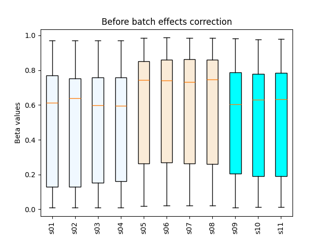
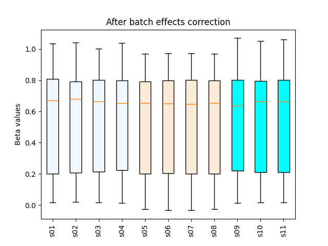

beta_combat
===========

Overview
--------

``beta_combat`` removes batch effects from a CpG-by-sample Beta-value matrix
using `ComBat <https://pubmed.ncbi.nlm.nih.gov/16632515/>`_.

If missing values are present, K-nearest-neighbor (KNN) imputation is applied
before ComBat. The command writes a fully corrected matrix and, when missing
values were present in the input, a second corrected matrix with the original
missing-value positions restored.

Input Files
-----------

Beta matrix
~~~~~~~~~~~

The input matrix must be tab-delimited, with **CpGs in rows** and **samples in
columns**. Compressed input is supported.

Requirements:

* first column: unique CpG IDs
* header: unique sample IDs
* at least two samples
* numeric methylation values

Example::

   CpG_ID   Sample_01   Sample_02   Sample_03
   cg_001   0.831035    0.878022    0.794427
   cg_002   0.249544    0.209949    0.234294
   cg_003   0.845065    0.843957    0.840184

Values outside [0, 1] are retained, but a warning is reported.

Batch file
~~~~~~~~~~

The batch file must contain at least two columns:

* sample ID
* batch/group ID

Comma-, tab-, or whitespace-delimited files are accepted. A header row is
optional.

Example with header::

   Sample,Group
   Sample_01,plate_1
   Sample_02,plate_1
   Sample_03,plate_2

Every sample in the Beta matrix must have one batch assignment. Extra batch
assignments for samples not present in the Beta matrix are ignored with a
warning.

At least two distinct batch groups are required.

Usage
-----

Basic usage::

   beta_combat \
       -i test_12_threebatch.beta.tsv.gz \
       -g test_12_threebatch.batch.csv \
       -o output

Useful options include:

* ``-k``, ``--neighbors`` -- number of KNN neighbors used when imputing
  missing values (default: 3)
* ``--axis 1`` -- search for neighboring samples after transposing the matrix
* ``--axis 0`` -- search for neighboring CpGs
* ``--no_plot`` -- skip the before/after box plots
* ``-o``, ``--out_prefix``, ``--output`` -- output prefix

Display all options with::

   beta_combat -h

Output
------

For output prefix ``output``, the command always writes:

* ``output.combat.tsv`` -- batch-corrected Beta-value matrix

If the input contained missing values, it also writes:

* ``output.combat_withNAs.tsv`` -- corrected matrix with the original
  missing-value positions restored

Unless ``--no_plot`` is used, the command also writes:

* ``output.boxplot.png`` -- Beta-value distributions before correction
* ``output.boxplot_combat.png`` -- Beta-value distributions after correction

Figures
-------

Example Data
------------

* `Beta matrix <https://sourceforge.net/projects/cpgtools/files/test/test_12_threebatch.beta.tsv.gz>`_
* `Beta matrix with missing values <https://sourceforge.net/projects/cpgtools/files/test/test_12_threebatch.beta.100K_NAs.tsv.gz>`_
* `Batch file <https://sourceforge.net/projects/cpgtools/files/test/test_12_threebatch.batch.csv>`_

Notes
-----

* CpG IDs and sample IDs in the Beta matrix must be unique.
* Batch-file sample IDs must also be unique.
* Batch groups containing fewer than two samples are allowed, but a warning is
  reported.
* KNN imputation is used only when missing values are present.
* If KNN imputation encounters an all-missing row or column that changes the
  matrix dimensions, the command exits with an error.
* This command performs basic ComBat correction; biological covariates should
  be handled separately when required.

Reference
---------

Johnson, W.E., Li, C., and Rabinovic, A. (2007).
*Adjusting batch effects in microarray expression data using empirical Bayes
methods.* **Biostatistics**, 8(1), 118--127.
`PubMed 16632515 <https://pubmed.ncbi.nlm.nih.gov/16632515/>`_.
