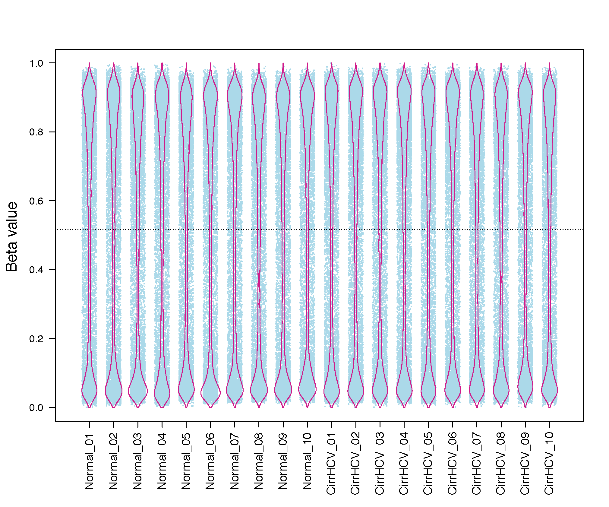

beta_jitter_plot
================

Overview
--------

``beta_jitter_plot`` visualizes DNA methylation Beta-value distributions for
each sample using a jitter (strip) plot overlaid with a bean plot.

The input matrix should have **CpGs in rows** and **samples in columns**.
Plotting is performed with R and the ``beanplot`` package.

Requirements
------------

The command requires:

* ``Rscript`` available in ``PATH``
* the R package `beanplot
  <https://cran.r-project.org/web/packages/beanplot/index.html>`_

Input
-----

The input must be a tab-delimited Beta-value matrix. Compressed input is
supported.

Example::

   CpG_ID   Sample_01   Sample_02   Sample_03   Sample_04
   cg_001   0.831035    0.878022    0.794427    0.880911
   cg_002   0.249544    0.209949    0.234294    0.236680
   cg_003   0.845065    0.843957    0.840184    0.824286

Sample IDs must be unique. Non-numeric values are treated as missing values.
Values outside the expected [0, 1] Beta-value range are retained, but a warning
is reported.

Example data:

* `test_05_TwoGroup.tsv.gz
  <https://sourceforge.net/projects/cpgtools/files/test/test_05_TwoGroup.tsv.gz>`_

Usage
-----

Basic usage::

   beta_jitter_plot \
       -i test_05_TwoGroup.tsv.gz \
       -f 1 \
       -o Jitter

Useful options include:

* ``-f``, ``--fraction`` -- fraction of CpGs plotted; must be in (0, 1]
  (default: 0.5)
* ``--seed`` -- random seed used when subsampling CpGs (default: 999)
* ``--width`` -- output PNG width in pixels (default: 800)
* ``--height`` -- output PNG height in pixels (default: 480)
* ``--point_size`` -- jitter-point size multiplier (default: 0.1)
* ``--jitter`` -- horizontal jitter width (default: 0.3)
* ``--keep_plot_data`` -- retain the sampled CpG matrix used for plotting
* ``-o``, ``--out_prefix``, ``--output`` -- output prefix

Display all options with::

   beta_jitter_plot -h

Output
------

For output prefix ``Jitter``, the command generates:

* ``Jitter.r`` -- R script used to generate the plot
* ``Jitter.png`` -- jitter/bean plot

The intermediate file ``Jitter.plot_data.tsv`` is removed after plotting by
default. Use ``--keep_plot_data`` to retain it.

Example Figure
--------------

