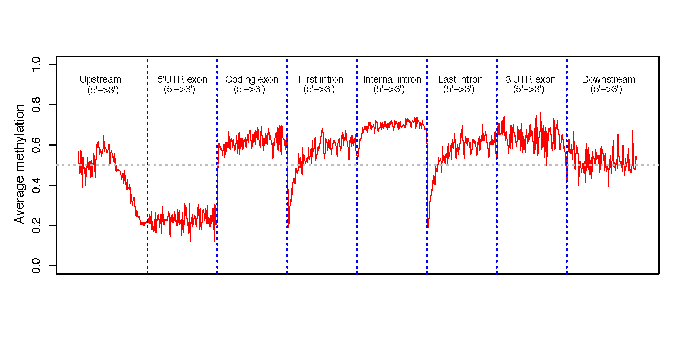

beta_profile_gene_centered.py
==============================

Description
------------
This program calculates the methylation profile (i.e. average beta value) for genomic regions
around genes. These genomic regions include: 

- 5'UTR exon
- CDS exon
- 3'UTR exon,
- first intron
- internal intron
- last intron
- up-stream intergenic
- down-stream intergenic

**Example of input (BED6+)**

::

 chr22   44021512        44021513        cg24055475      0.9231  -
 chr13   111568382       111568383       cg06540715      0.1071  +
 chr20   44033594        44033595        cg21482942      0.6122  -

Options
--------

  --version             show program's version number and exit
  -h, --help            show this help message and exit
  -i INPUT_FILE, --input-file-INPUT_FILE
                        BED6+ file specifying the C position. This BED file
                        should have at least 6 columns (Chrom, ChromStart,
                        ChromeEnd, Name, Beta_value, Strand). BED6+ file can
                        be a regular text file or compressed file (.gz, .bz2).
  -r GENE_FILE, --refgene-GENE_FILE
                        Reference gene model in standard BED12 format
                        (https://genome.ucsc.edu/FAQ/FAQformat.html#format1).
                        "Strand" column must exist in order to decide 5' and
                        3' UTRs, up- and down-stream intergenic regions.
  -d DOWNSTREAM_SIZE, --downstream-DOWNSTREAM_SIZE
                        Size of down-stream genomic region added to gene.
                        default-2000 (bp)
  -u UPSTREAM_SIZE, --upstream-UPSTREAM_SIZE
                        Size of up-stream genomic region added to gene.
                        default-2000 (bp)
  -o OUT_FILE, --output-OUT_FILE
                        Prefix of the output file.

- `test_02.bed6.gz <https://sourceforge.net/projects/cpgtools/files/test/test_02.bed6.gz>`_
- `hg19.RefSeq.union.bed.gz <https://sourceforge.net/projects/cpgtools/files/refgene/hg19.RefSeq.union.bed.gz>`_  

Command
----------
::

$beta_profile_gene_centered.py -i test_02.bed6.gz  -r hg19.RefSeq.union.bed.gz -o gene_profile

Output files
--------------

- gene_profile.txt
- gene_profile.r
- gene_profile.pdf

