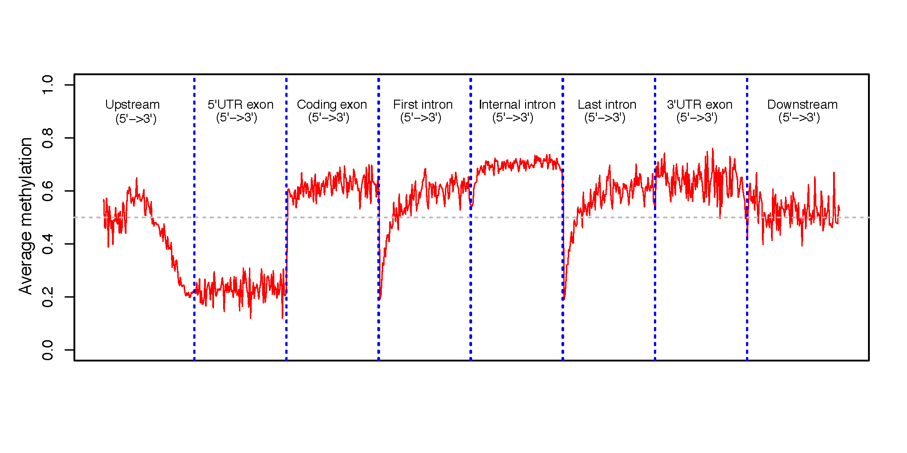

beta_profile_gene_centered
==========================

Overview
--------

``beta_profile_gene_centered`` generates a transcript-oriented DNA
methylation profile across major gene-centered genomic regions.

The profile summarizes average Beta-values across:

* upstream intergenic regions
* 5' UTR exons
* coding exons
* first introns
* internal introns
* last introns
* 3' UTR exons
* downstream intergenic regions

All regions are oriented from 5' to 3' according to transcript strand.

Input Files
-----------

Methylation file
~~~~~~~~~~~~~~~~

The methylation input must be BED6 or BED6+ with Beta-values in column 5 and
strand information in column 6. Compressed input is supported when supported
by the CpGtools reader.

The first six columns are expected to represent:

``chrom``, ``start``, ``end``, ``name``, ``Beta_value``, ``strand``

Example::

   chr22   44021512    44021513    cg24055475    0.9231    -
   chr13   111568382   111568383   cg06540715    0.1071    +
   chr20   44033594    44033595    cg21482942    0.6122    -

Gene model
~~~~~~~~~~

The reference gene model must be in BED12 format. Strand information is used
to determine transcript orientation, UTRs, introns, and upstream/downstream
regions.

Usage
-----

Basic usage::

   beta_profile_gene_centered \
       -i test_02.bed6.gz \
       -r hg19.RefSeq.union.bed.gz \
       -o gene_profile

By default, 2,000 bp are included upstream and downstream of each gene.

Useful options include:

* ``-u``, ``--upstream`` -- upstream intergenic length in bp
  (default: 2000)
* ``-d``, ``--downstream`` -- downstream intergenic length in bp
  (default: 2000)
* ``--format {png,pdf,both}`` -- plot output format
  (default: ``pdf``)
* ``--dpi`` -- PNG resolution (default: 300)
* ``--width`` -- plot width in inches (default: 10)
* ``--height`` -- plot height in inches (default: 5)
* ``--no_plot`` -- write the profile table without generating a plot
* ``-o``, ``--out_prefix``, ``--output`` -- output prefix

Display all options with::

   beta_profile_gene_centered -h

Output
------

For output prefix ``gene_profile``, the command always writes:

* ``gene_profile.gene_centered_profile.tsv`` -- normalized methylation profile

Unless ``--no_plot`` is used, it also writes one or more plots:

* ``gene_profile.gene_centered_profile.pdf``
* ``gene_profile.gene_centered_profile.png``

Use ``--format both`` to generate both plot formats.

The profile table contains:

* ``Group`` -- genomic-region category
* ``Relative_position(5'->3')`` -- normalized position within the region
* ``Average_beta`` -- average methylation value

Example Data
------------

* `CpG BED6 file <https://sourceforge.net/projects/cpgtools/files/test/test_02.bed6.gz>`_
* `hg19 RefSeq BED12 gene model <https://sourceforge.net/projects/cpgtools/files/refgene/hg19.RefSeq.union.bed.gz>`_

Example Figure
--------------

