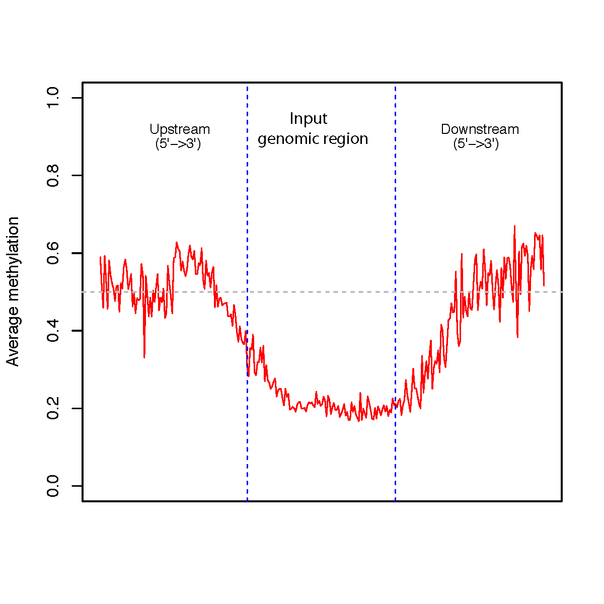

beta_profile_region
===================

Overview
--------

``beta_profile_region`` generates a strand-aware DNA methylation profile
across user-defined genomic regions and their upstream/downstream flanks.

Profiles are normalized and oriented **5' to 3'** relative to the strand of
each target region. Three profile groups are reported:

* upstream flank
* target region
* downstream flank

Input Files
-----------

Methylation file
~~~~~~~~~~~~~~~~

The methylation input must be BED6 or BED6+ with Beta-values in column 5.

The first six columns are expected to represent:

``chrom``, ``start``, ``end``, ``name``, ``Beta_value``, ``strand``

Example::

   chr22   44021512    44021513    cg24055475    0.9231    -
   chr13   111568382   111568383   cg06540715    0.1071    +
   chr20   44033594    44033595    cg21482942    0.6122    -

Compressed input is supported when supported by the CpGtools reader.

Region file
~~~~~~~~~~~

The target-region input must be BED3 or BED3+. If column 6 is present, it is
used as the strand. If strand is absent or is not ``+`` or ``-``, the region
is treated as being on the ``+`` strand.

Example::

   chr1    15864    15865
   chr1    18826    18827
   chr1    29406    29407

Exact duplicate target intervals are removed while preserving input order.

Usage
-----

Basic usage::

   beta_profile_region \
       -r hg19.RefSeq.union.1Kpromoter.bed.gz \
       -i test_02.bed6.gz \
       -o region_profile

By default, 2,000 bp are profiled upstream and downstream of each target
region.

Useful options include:

* ``-u``, ``--upstream`` -- upstream flank length in bp
  (default: 2000)
* ``-d``, ``--downstream`` -- downstream flank length in bp
  (default: 2000)
* ``--format {png,pdf,both}`` -- plot output format
  (default: ``pdf``)
* ``--dpi`` -- PNG resolution (default: 300)
* ``--width`` -- plot width in inches (default: 8)
* ``--height`` -- plot height in inches (default: 5)
* ``--no_plot`` -- write the profile table without generating a plot
* ``-o``, ``--out_prefix``, ``--output`` -- output prefix

Display all options with::

   beta_profile_region -h

Output
------

For output prefix ``region_profile``, the command always writes:

* ``region_profile.region_profile.tsv`` -- normalized methylation profile

The table contains:

* ``Group`` -- ``Upstream_region``, ``User_region``, or ``Downstream_region``
* ``Relative_position(5'->3')`` -- normalized position within each profile group
* ``Average_beta`` -- average methylation value

Unless ``--no_plot`` is used, the command also writes one or more plots:

* ``region_profile.region_profile.pdf``
* ``region_profile.region_profile.png``

Use ``--format both`` to generate both plot formats.

Example Data
------------

* `CpG BED6 file <https://sourceforge.net/projects/cpgtools/files/test/test_02.bed6.gz>`_
* `Example promoter regions <https://sourceforge.net/projects/cpgtools/files/test/hg19.RefSeq.union.1Kpromoter.bed.gz/download>`_

Example Figure
--------------

