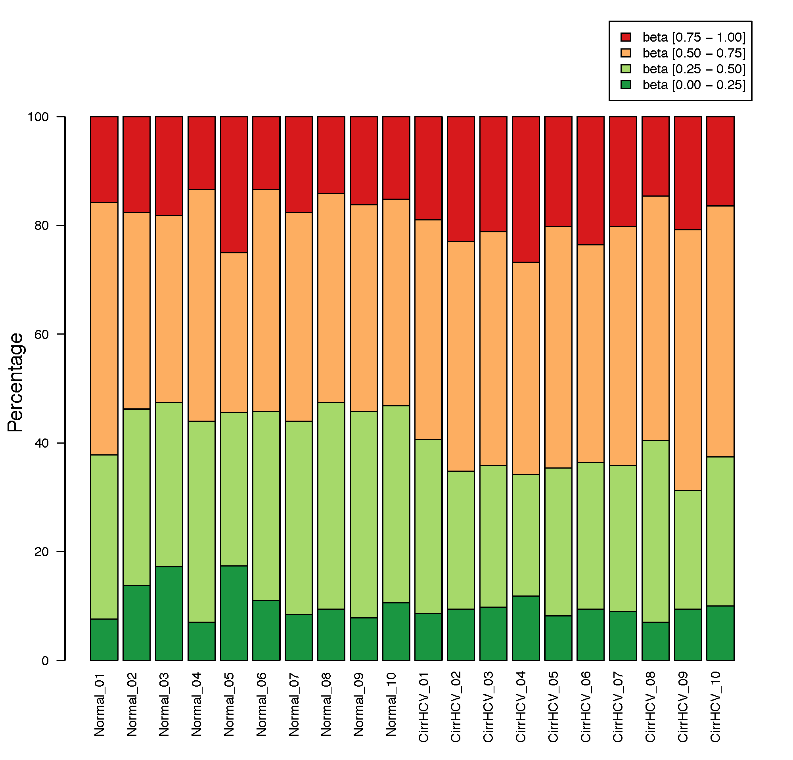

beta_stacked_barplot
====================

Overview
--------

``beta_stacked_barplot`` summarizes the distribution of Beta-values for each
sample and optionally generates a stacked bar plot.

The input matrix should have **CpGs in rows** and **samples in columns**.

Beta-values are grouped into four intervals:

* [0.00, 0.25]
* (0.25, 0.50]
* (0.50, 0.75]
* (0.75, 1.00]

Input
-----

The input is a tabular Beta-value matrix. Delimiters are detected
automatically and compressed input is supported.

Example::

   CpG_ID   Sample_01   Sample_02   Sample_03   Sample_04
   cg_001   0.831035    0.878022    0.794427    0.880911
   cg_002   0.249544    0.209949    0.234294    0.236680

By default, finite values outside [0, 1] cause an error.

Usage
-----

Basic usage::

   beta_stacked_barplot \
       -i cirrHCV_vs_normal.data.tsv \
       -o stacked_bar

Useful options include:

* ``--format {png,pdf,both}`` -- plot format (default: ``pdf``)
* ``--dpi`` -- PNG resolution (default: 300)
* ``--width`` and ``--height`` -- plot size in inches
* ``--no_plot`` -- write only the summary table
* ``--allow_out_of_range`` -- ignore finite values outside [0, 1]

Display all options with::

   beta_stacked_barplot -h

Output
------

For output prefix ``stacked_bar``, the command writes:

* ``stacked_bar.stacked_barplot.tsv`` -- counts and percentages for each
  sample and Beta-value interval
* ``stacked_bar.stacked_barplot.pdf`` -- plot when ``--format pdf`` is used
* ``stacked_bar.stacked_barplot.png`` -- plot when ``--format png`` is used

Use ``--format both`` to generate both plot formats.

Example Data
------------

* `cirrHCV_vs_normal.data.tsv <https://sourceforge.net/projects/cpgtools/files/test/cirrHCV_vs_normal.data.tsv>`_

Example Figure
--------------

