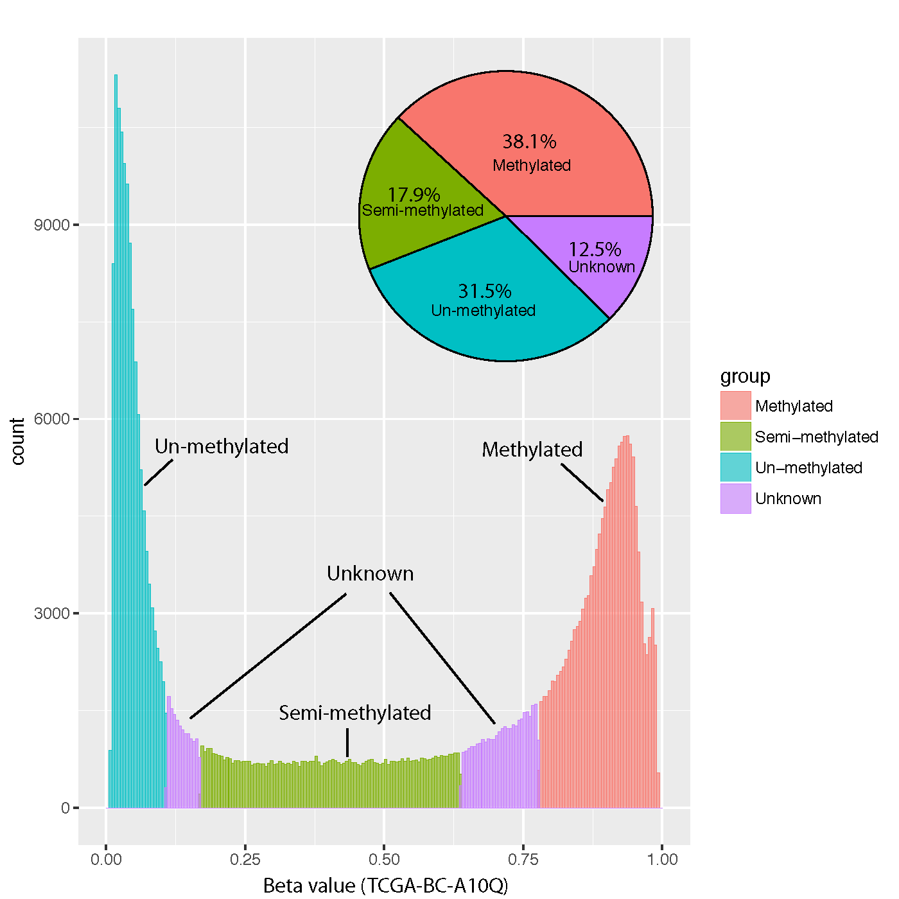

beta_trichotmize
=================

Overview
--------

``beta_trichotmize`` classifies DNA methylation Beta-values into three
methylation states using a **three-component Bayesian Gaussian mixture model
(BGMM)** fitted independently to each sample.

The input matrix should have **CpGs in rows** and **samples in columns**.

The three mixture components are ordered by their fitted means and mapped to:

.. list-table::
   :header-rows: 1
   :widths: 18 32 50

   * - State
     - Label
     - Interpretation
   * - ``0``
     - Unmethylated
     - Lowest-mean BGMM component.
   * - ``1``
     - Partially methylated
     - Intermediate-mean BGMM component.
   * - ``2``
     - Fully methylated
     - Highest-mean BGMM component.
   * - ``-1``
     - Unassigned
     - Maximum posterior probability is below the assignment cutoff.

Unlike a fixed Beta-value threshold, classification is based on the posterior
probability of the fitted mixture components.

Algorithm
---------

For each sample, ``beta_trichotmize`` fits a Bayesian Gaussian mixture model
with three components. The components are sorted by their means from lowest to
highest methylation.

For each CpG, the model calculates:

* :math:`p_0` -- posterior probability of the unmethylated component
* :math:`p_1` -- posterior probability of the partially methylated component
* :math:`p_2` -- posterior probability of the fully methylated component

The CpG is assigned to the component with the largest posterior probability
only when that probability is at least ``--prob_cutoff``. Otherwise, its state
is ``-1`` (unassigned).

Input
-----

The input is a tabular Beta-value matrix. Common delimiters and compressed
input are supported.

Example::

   CpG_ID   Sample_01   Sample_02   Sample_03   Sample_04
   cg_001   0.831035    0.878022    0.794427    0.880911
   cg_002   0.249544    0.209949    0.234294    0.236680
   cg_003   0.845065    0.843957    0.840184    0.824286

Requirements:

* CpG IDs must be unique.
* Sample IDs must be unique.
* Finite Beta-values must fall within [0, 1].
* Each sample must contain at least three valid and three distinct Beta-values.

Missing Values
--------------

Two missing-value policies are available:

.. list-table::
   :header-rows: 1
   :widths: 24 76

   * - Policy
     - Description
   * - ``per_sample``
     - Default. Each sample is fitted using its available Beta-values.
   * - ``drop``
     - Remove every CpG containing a missing value in any sample before model
       fitting.

Usage
-----

Basic usage::

   beta_trichotmize \
       -i test_05_TwoGroup.tsv.gz \
       -o trichotomized

Useful options include:

* ``-c``, ``--prob_cutoff``, ``--prob-cut`` -- minimum posterior probability
  required for assignment (default: 0.95)
* ``-s``, ``--seed`` -- random seed for BGMM fitting (default: 99)
* ``--max_iter`` -- maximum BGMM iterations per sample (default: 5000)
* ``--tol`` -- convergence tolerance (default: ``1e-3``)
* ``--covariance_type {full,tied,diag,spherical}`` -- covariance model
  (default: ``full``)
* ``--weight_concentration_prior`` -- optional Dirichlet-process concentration
  prior
* ``--na_policy {drop,per_sample}`` -- missing-value handling
* ``--report`` -- write a BGMM model-summary table
* ``--long_format`` -- write one long-format classification table instead of
  separate state/probability matrices
* ``-o``, ``--out_prefix``, ``--output`` -- output prefix

Display all options with::

   beta_trichotmize -h

Output
------

Matrix format
~~~~~~~~~~~~~

By default, the command writes five matrices.

For output prefix ``trichotomized``:

* ``trichotomized.methylation_states.tsv`` -- assigned state for each CpG and
  sample
* ``trichotomized.assignment_probability.tsv`` -- posterior probability of
  the assigned/best state
* ``trichotomized.probability_0_unmethylated.tsv`` -- posterior probability
  of state 0
* ``trichotomized.probability_1_partially_methylated.tsv`` -- posterior
  probability of state 1
* ``trichotomized.probability_2_fully_methylated.tsv`` -- posterior
  probability of state 2

State values are ``0``, ``1``, ``2``, or ``-1`` for unassigned CpGs.

Long format
~~~~~~~~~~~

With ``--long_format``, the separate matrices are replaced by:

* ``trichotomized.trichotomized.long.tsv``

The table contains:

* ``CpG_ID``
* ``sample``
* ``beta_value``
* ``probability_0``
* ``probability_1``
* ``probability_2``
* ``assigned_state``
* ``assignment_probability``

Model summary
~~~~~~~~~~~~~

With ``--report``, the command additionally writes:

* ``trichotomized.bgmm_summary.tsv``

The summary contains one row per sample with component means and weights,
convergence information, number of valid CpGs, and numbers of assigned and
unassigned CpGs.

Example Data
------------

* `test_05_TwoGroup.tsv.gz
  <https://sourceforge.net/projects/cpgtools/files/test/test_05_TwoGroup.tsv.gz>`_

Example Figure
--------------

The following example illustrates the distribution of CpGs assigned to the
three methylation states.

