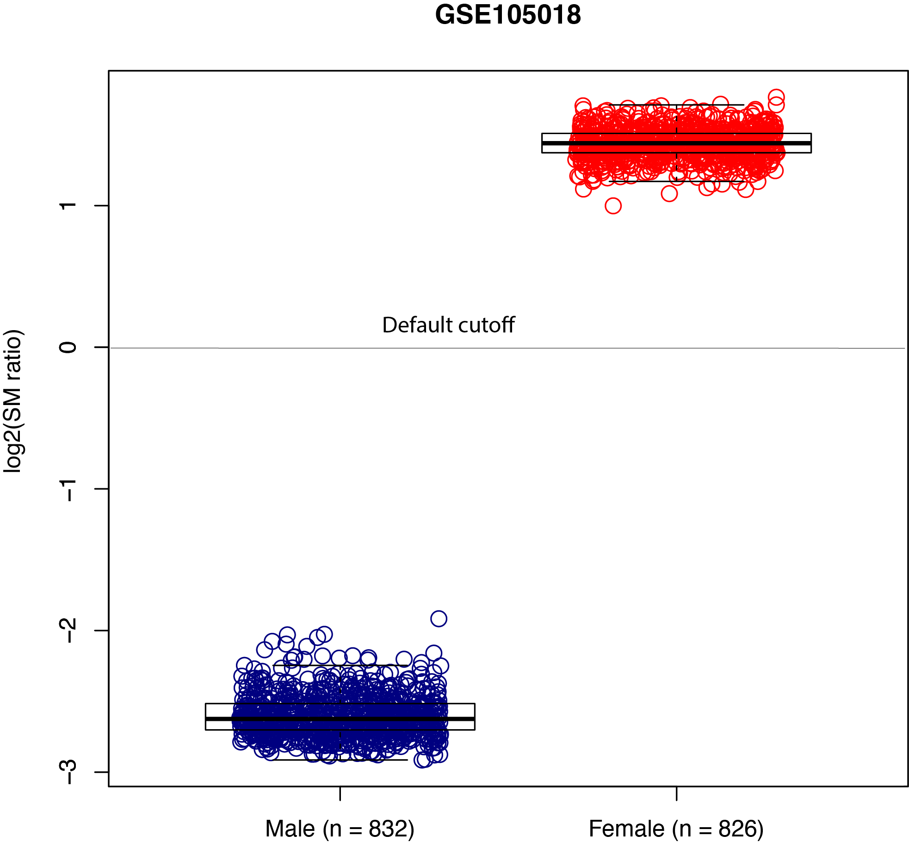

predict_sex.py
==============

Description
------------
Predict sex based on the semi-methylation (also known as genomic imprinting)
ratio. This method leverages the fact that, due to X chromosome inactivation,
females have a higher proportion of semi-methylated CpGs on their X chromosomes.
A log2(ratio) greater than 0 indicates a female, while a log2(ratio) less than
0 indicates a male.

Options
-----------

  Options:
    --version             show program's version number and exit
    -h, --help            show this help message and exit
    -i INPUT_FILE, --input_file=INPUT_FILE
                          Tab-separated data frame file containing beta values
                          with the 1st row containing sample IDs and the 1st
                          column containing CpG IDs.
    -x XPROBE_FILE, --xprobe=XPROBE_FILE
                          File with CpG IDs mapped to the X chromosome, with one
                          probe listed per row.
    -c CUTOFF, --cut=CUTOFF
                          The cutoff of log2(SM ratio) to determine the sex
                          prediction. Log2(SM ratio) greater than this cutoff
                          indicates a female, while a log2(ratio) less than this
                          cutoff indicates a male. default=0.0
    -o OUT_FILE, --output=OUT_FILE
                          The prefix of the output file.

Input files (examples)
------------------------

- `test_10.tsv.gz <https://sourceforge.net/projects/cpgtools/files/test/test_10.tsv.gz>`_
- `chrX_CpGs.txt.gz <https://sourceforge.net/projects/cpgtools/files/test/chrX_CpGs.txt.gz>`_

Command
-----------
::
 
 predict_sex.py -x chrX_CpGs.txt.gz -i test_10.tsv.gz -o output
 
Output files
---------------

- output.predicted_sex.tsv

::

 $ cat output.predicted_sex.tsv
 Sample_ID log2_SM_ratio Predicted_sex
 2621  -2.249628052954919  Male
 2622  -2.2671726671830674 Male
 2691  1.4530581933290616  Female

Evaluation
-----------

When evaluating this classifier with Illumina HumanMethylation450 BeadChip data (`GSE105018 <https://www.ncbi.nlm.nih.gov/geo/query/acc.cgi?acc=GSE105018>`_) from 832 males and 826 females, the prediction accuracy achieved is 100%.

