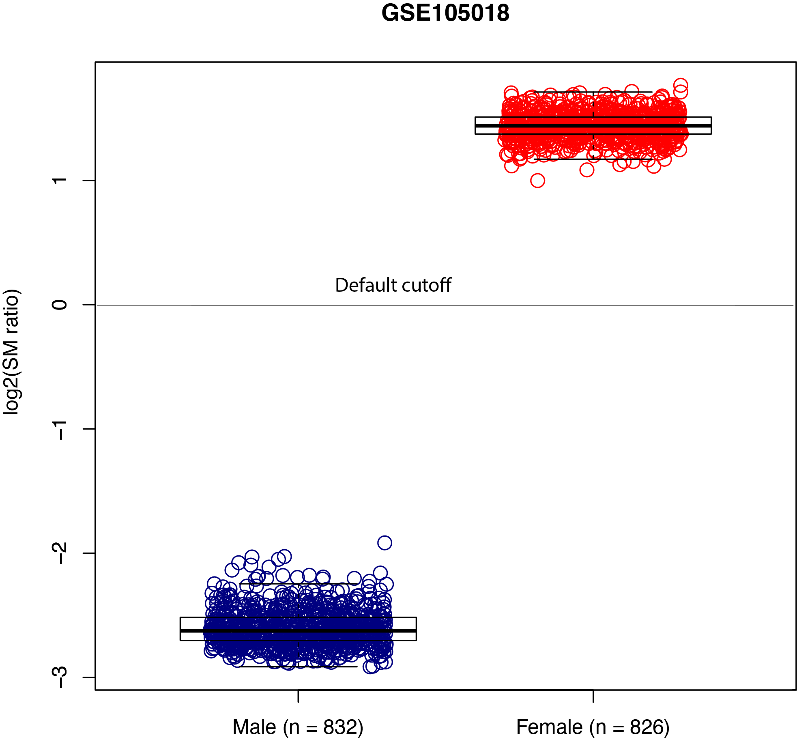

predict_sex
===========

Overview
--------

``predict_sex`` predicts biological sex from X-chromosome DNA methylation
using the semi-methylation (SM) ratio.

The method uses the observation that X-chromosome inactivation produces a
higher proportion of semi-methylated CpGs in samples with two X chromosomes.

For each sample, X-linked CpGs are divided into three Beta-value ranges:

.. list-table::
   :header-rows: 1
   :widths: 24 38 38

   * - Category
     - Beta-value range
     - Interpretation
   * - Low
     - ``0.0 <= beta <= 0.2``
     - Low methylation.
   * - Mid
     - ``0.3 <= beta <= 0.7``
     - Semi-methylation range.
   * - High
     - ``0.8 <= beta <= 1.0``
     - High methylation.

The score is calculated as:

.. math::

   \log_2(\mathrm{SM\ ratio})
   =
   \log_2\left(
   \frac{N_{\mathrm{mid}}}
        {N_{\mathrm{low}} + N_{\mathrm{high}}}
   \right)

where ``N_mid``, ``N_low``, and ``N_high`` are the numbers of X-linked CpGs
falling in the corresponding Beta-value ranges.

Prediction Rule
---------------

With cutoff :math:`c`:

* ``log2_SM_ratio > c`` -> ``Female``
* ``log2_SM_ratio < c`` -> ``Male``
* ``log2_SM_ratio == c`` -> ``Unknown``

The default cutoff is ``0.0``.

The prediction is also ``Unknown`` when the SM ratio is undefined, for
example when there are no CpGs in the mid range or when the combined low/high
count is zero.

Input Files
-----------

Beta-value matrix
~~~~~~~~~~~~~~~~~

The input must be a **tab-separated** Beta-value matrix with **CpGs in rows**
and **samples in columns**.

Example::

   CpG_ID   Sample_01   Sample_02   Sample_03
   cg_001   0.831035    0.878022    0.794427
   cg_002   0.249544    0.209949    0.234294
   cg_003   0.845065    0.843957    0.840184

Requirements:

* CpG IDs must be unique.
* Sample IDs must be unique.
* At least one sample must be present.

Non-numeric values are converted to missing values and ignored independently
for each sample.

X-chromosome CpG file
~~~~~~~~~~~~~~~~~~~~~

The X-probe file contains one X-chromosome CpG ID per line.

Example::

   cg00000029
   cg00000108
   cg00000165

Blank lines and lines beginning with ``#`` are ignored. Duplicate probe IDs
are removed automatically.

At least one supplied X-linked CpG must also be present in the Beta-value
matrix.

Usage
-----

Basic usage::

   predict_sex \
       -i test_10.tsv.gz \
       -x chrX_CpGs.txt.gz \
       -o output

Use a custom cutoff::

   predict_sex \
       -i test_10.tsv.gz \
       -x chrX_CpGs.txt.gz \
       --cut 0.25 \
       -o output

Available options are:

* ``-i``, ``--input_file`` -- tab-separated Beta-value matrix
* ``-x``, ``--xprobe`` -- X-chromosome CpG-ID file
* ``-c``, ``--cut`` -- log2 SM-ratio cutoff (default: 0.0)
* ``-o``, ``--output`` -- output prefix
* ``--version`` -- show the CpGtools version

Display all options with::

   predict_sex -h

Output
------

For output prefix ``output``, the command writes:

* ``output.predicted_sex.tsv``

The output contains one row per sample:

.. list-table::
   :header-rows: 1
   :widths: 28 72

   * - Column
     - Description
   * - ``Sample_ID``
     - Sample identifier from the input matrix.
   * - ``log2_SM_ratio``
     - Log2 semi-methylation ratio.
   * - ``Predicted_sex``
     - ``Male``, ``Female``, or ``Unknown``.
   * - ``X_CpGs_used``
     - Number of finite X-linked Beta-values available for that sample.
   * - ``Low_beta_CpGs``
     - Number of X-linked CpGs with Beta-values in [0.0, 0.2].
   * - ``Mid_beta_CpGs``
     - Number of X-linked CpGs with Beta-values in [0.3, 0.7].
   * - ``High_beta_CpGs``
     - Number of X-linked CpGs with Beta-values in [0.8, 1.0].

Undefined numeric ratios are written as ``NaN``.

Example Data
------------

* `Beta-value matrix
  <https://sourceforge.net/projects/cpgtools/files/test/test_10.tsv.gz>`_
* `X-chromosome CpG list
  <https://sourceforge.net/projects/cpgtools/files/test/chrX_CpGs.txt.gz>`_

Evaluation
----------

In the original CpGtools evaluation using Illumina HumanMethylation450
BeadChip data from `GSE105018
<https://www.ncbi.nlm.nih.gov/geo/query/acc.cgi?acc=GSE105018>`_, the
classifier was reported to correctly classify 832 male and 826 female
samples.

