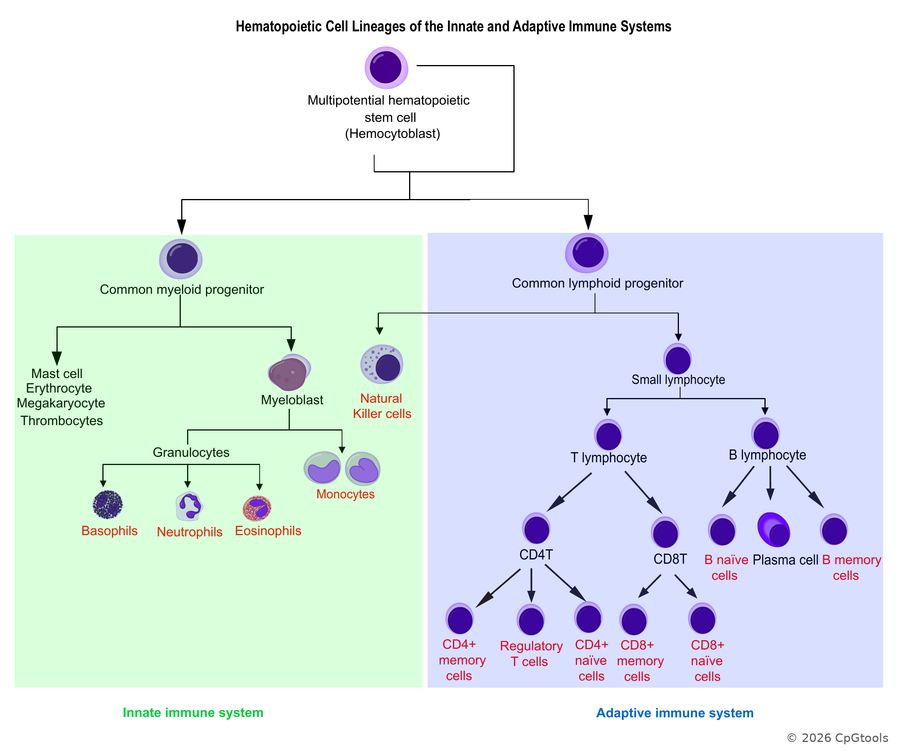

Overview
========

**CpGtools** is a Python package providing command-line tools for DNA
methylation data analysis. It supports data from Illumina methylation arrays
(450K, EPIC, and EPIC v2) and bisulfite sequencing platforms such as RRBS
and WGBS.

Most CpGtools commands that operate on methylation matrices expect
**CpGs in rows and samples in columns**, unless otherwise stated by the
individual command.

Some key functions of CpGtools include:

* **Basic data manipulation** (e.g., quality control, annotation, visualization, and Beta-to-M value transformation)
* **Dimensionality reduction** (PCA, t-SNE, and UMAP)
* **Missing-value imputation** (KNN, Random Forest, iterative linear regression, and MOREL [Ma2026]_)
* **Cell-type deconvolution** (12 immune cell types)
* **Differential methylation analysis** (linear regression, logistic regression, beta-binomial regression, t-test, ANOVA, and Bayesian methods)
* **Epigenetic clock estimation** (30+ clocks for humans, mice, and mammals)
* **Phenotype prediction** (multiple traits; under development)

The main command groups are summarized below.

CpG Position Analysis
---------------------

Tools for annotating CpGs and characterizing/visualizing their genomic distribution.

.. list-table::
   :header-rows: 1
   :widths: 30 70

   * - Command
     - Description
   * - ``CpG_aggregation``
     - Aggregate CpG methylation values within genomic regions.
   * - ``CpG_anno_position``
     - Annotate CpGs using genomic coordinates.
   * - ``CpG_anno_probe``
     - Annotate Illumina 450K, EPIC, and EPIC v2 probes.
   * - ``CpG_density_gene_centered``
     - Calculate CpG density across gene-centered regions.
   * - ``CpG_distrb_chrom``
     - Summarize the chromosomal distribution of CpGs.
   * - ``CpG_distrb_gene_centered``
     - Summarize CpG distribution across gene-centered features.
   * - ``CpG_distrb_region``
     - Summarize CpG distribution across user-defined regions.
   * - ``CpG_logo``
     - Generate sequence logos for CpGs and flanking sequences.
   * - ``CpG_to_gene``
     - Assign CpGs to putative target genes using a GREAT-like approach.

CpG Signal Analysis
-------------------

Tools for transforming, summarizing, visualizing, and exploring DNA
methylation matrices.

.. list-table::
   :header-rows: 1
   :widths: 30 70

   * - Command
     - Description
   * - ``beta_combat``
     - Correct batch effects using ComBat.
   * - ``beta_jitter_plot``
     - Visualize sample methylation distributions.
   * - ``beta_m_conversion``
     - Convert between Beta-values and M-values.
   * - ``beta_PCA``
     - Perform principal component analysis.
   * - ``beta_profile_gene_centered``
     - Plot methylation profiles across gene-centered regions.
   * - ``beta_profile_region``
     - Plot methylation profiles across user-defined regions.
   * - ``beta_selectNBest``
     - Select informative CpGs using feature-selection methods.
   * - ``beta_stacked_barplot``
     - Summarize methylation states with stacked bar plots.
   * - ``beta_stats``
     - Calculate methylation statistics.
   * - ``beta_topN``
     - Select highly variable CpGs.
   * - ``beta_trichotmize``
     - Classify CpGs into methylation states.
   * - ``beta_tSNE``
     - Perform t-SNE dimensionality reduction.
   * - ``beta_UMAP``
     - Perform UMAP dimensionality reduction.

Differential Methylation Analysis
---------------------------------

Tools for identifying differentially methylated CpGs (DMCs) using array
Beta-values or sequencing-derived methylation counts.

.. list-table::
   :header-rows: 1
   :widths: 30 70

   * - Command
     - Description
   * - ``dmc_Bayes``
     - Bayesian differential methylation analysis.
   * - ``dmc_bb``
     - Beta-binomial analysis of RRBS/WGBS methylation counts.
   * - ``dmc_fisher``
     - Fisher's exact test for sequencing-derived methylation counts.
   * - ``dmc_glm``
     - Generalized linear model analysis.
   * - ``dmc_logit``
     - Logistic-regression analysis of methylation counts.
   * - ``dmc_nonparametric``
     - Mann--Whitney U and Kruskal--Wallis tests.
   * - ``dmc_ttest``
     - Student's *t*-test for methylation-array data.

Missing-value Imputation
------------------------

``beta_impute`` provides a unified interface for detecting, simulating,
evaluating, and imputing missing values in methylation matrices. Imputation
performance can optionally be evaluated against a truth matrix using MAE,
RMSE, and :math:`R^2`.

.. raw:: html

   

.. list-table::
   :header-rows: 1
   :widths: 24 76
   :class: imputation-table

   * - Method
     - Brief description
   * - ``constant``
     - Replace all missing values with a user-specified constant.
   * - ``mean``
     - Replace missing values with row-wise or column-wise means.
   * - ``median``
     - Replace missing values with row-wise or column-wise medians.
   * - ``min`` / ``max``
     - Replace missing values with row-wise or column-wise minima or maxima.
   * - ``rand``
     - Replace missing values using randomly selected observed values from the
       same row or column.
   * - ``refknn``
     - Use K-nearest neighbors from an external complete reference matrix.
   * - ``mw``
     - Impute from neighboring values in a moving window using the mean or
       median.
   * - ``knn``
     - Use scikit-learn KNN imputation within the input methylation matrix.
   * - ``buck``
     - Iterative regression imputation based on the method of Buck (1960).
   * - ``rf``
     - Iteratively predict missing values with Random Forest regression.
   * - ``softimpute``
     - Low-rank matrix completion using iterative soft-thresholded SVD.
   * - ``morel`` [Ma2026]_
     - Impute systematic block-wise missingness using Random Forest or a dense
       neural network, with KNN for sporadic missing values.
   * - ``gnn``
     - Impute from genomically neighboring CpGs, optionally restricted by
       candidate cis-regulatory elements.

The command also provides utilities such as ``toy``, ``insertna``,
``dropna``, and ``countna`` for generating test matrices and inspecting
missingness.

For details, see :doc:`demo/beta_impute`.

.. [Ma2026] Tao Ma, Jinfu Nie, Jian Huang, Yong-Biao Zhang, Joanna M. Biernacka,
   Liguo Wang. *Multi-output learning for systematic missing value imputation in
   DNA methylation arrays*. Bioinformatics Advances, Volume 6, Issue 1, 2026,
   vbag052. https://doi.org/10.1093/bioadv/vbag052

Cell-type Deconvolution
-----------------------

``beta_deconvolution`` estimates cell-type proportions from bulk DNA
methylation profiles using NNLS or constrained least-squares methods. 
The current reference panel includes the following **12 cell types labeled in red text**:

Use ``beta_deconvolution -h`` for input requirements and available options.

Epigenetic Aging Analysis
-------------------------

``epical`` provides a unified interface for DNA methylation age prediction
and related epigenetic aging measures. It includes human, pediatric,
gestational-age, tissue-specific, mouse, and pan-mammalian models.

.. list-table::
   :header-rows: 1
   :widths: 28 72

   * - Clock / model
     - Brief description
   * - ``Horvath13``
     - Original Horvath multi-tissue human DNAm age clock.
   * - ``Horvath13_shrunk``
     - Reduced-CpG version of the Horvath multi-tissue clock.
   * - ``Horvath18``
     - Horvath skin-and-blood clock for several cultured and primary tissues.
   * - ``Levine``
     - DNAm PhenoAge, developed to capture aging-related phenotypic risk in
       blood.
   * - ``Hannum``
     - Blood-based human DNAm age clock.
   * - ``Zhang_EN``
     - Zhang human age predictor fitted using elastic-net regression.
   * - ``Zhang_BLUP``
     - Zhang human age predictor based on a BLUP model.
   * - ``AltumAge``
     - Deep-learning DNAm age predictor.
   * - ``Lu_DNAmTL``
     - DNA methylation estimator of telomere length.
   * - ``Weidner``
     - Compact human blood DNAm age predictor.
   * - ``Lin``
     - Human DNAm age predictor based on age-associated CpGs.
   * - ``ENCen100``
     - Epigenetic age model based on the EN/Cen 100-CpG signature.
   * - ``ENCen40``
     - Reduced 40-CpG version of the EN/Cen model.
   * - ``DunedinPACE``
     - Estimates the pace of biological aging rather than chronological age.
   * - ``Ped_Wu``
     - Pediatric DNAm age model.
   * - ``PedBE``
     - Pediatric buccal epigenetic age clock.
   * - ``GA_Bohlin``
     - Gestational-age predictor developed by Bohlin and colleagues.
   * - ``GA_Haftorn``
     - Gestational-age predictor developed by Haftorn and colleagues.
   * - ``GA_Knight``
     - Gestational-age predictor developed by Knight and colleagues.
   * - ``GA_Mayne``
     - Gestational-age predictor developed by Mayne and colleagues.
   * - ``GA_Lee_CPC``
     - Lee gestational-age model based on cord-blood cell proportions/CpGs.
   * - ``GA_Lee_RPC``
     - Lee robust placental/gestational-age model.
   * - ``GA_Lee_rRPC``
     - Refined version of the Lee RPC gestational-age model.
   * - ``Cortical``
     - DNAm age clock optimized for human cortical tissue.
   * - ``MEAT``
     - Muscle Epigenetic Age Test for skeletal muscle.
   * - ``EPM``
     - Epigenetic Pacemaker model for estimating epigenetic state changes.
   * - ``WLMT``
     - Whole-lifespan, multi-tissue mouse DNAm age clock.
   * - ``YOMT``
     - Multi-tissue mouse DNAm age predictor.
   * - ``mmLiver``
     - Mouse liver-specific DNAm age predictor.
   * - ``mmBlood``
     - Mouse blood-specific DNAm age predictor.
   * - ``mammClock1``
     - Pan-mammalian multi-tissue DNAm age clock.
   * - ``mammClock2``
     - Pan-mammalian multi-tissue DNAm age clock using an alternative CpG set.
   * - ``mammClock3``
     - Pan-mammalian multi-tissue DNAm age clock using an alternative CpG set.

Use ``epical -h`` to list available clocks and ``epical CLOCK -h`` for
clock-specific requirements.

Command-line Usage
------------------

CpGtools commands are installed as console programs. Use ``-h`` or
``--help`` to display command-specific input requirements and options, for
example::

    epical -h
    beta_impute -h
    beta_deconvolution -h
    dmc_bb -h

Individual commands may require specialized input formats. See the
corresponding documentation pages for detailed examples.
